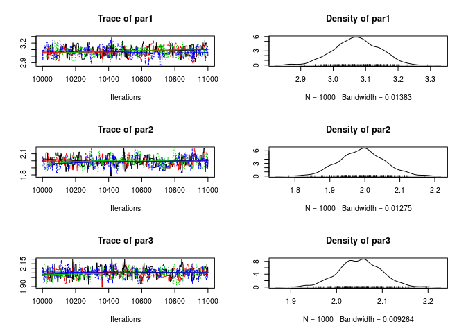

amcmc: Adaptive and other Markov Chain Monte Carlo methods
================

[](https://travis-ci.org/USCbiostats/amcmc)
[](https://ci.appveyor.com/project/gvegayon/amcmc)
[](https://codecov.io/github/USCbiostats/amcmc?branch=master)
[](https://www.tidyverse.org/lifecycle/#experimental)

The `amcmc` R package implements out-of-the-box methods for Adaptive
Markov Chain Monte Carlo, and Optimal Scaling Algorithms of Random Walk
MCMC. Designed to be used with the `coda` R package, `amcmc` allows
running multiple chains simultaneously (parallel computing), using
Parallel Tempering MCMC, and Random Walks with Reflecting Boundaries.

Current features:

1.  Automatic stop using convergence checker.

2.  Parallel chains using `parallel::lapply`

3.  Normal Random Walk with Reflective Boundaries kernel.

# Installing

From github:

``` r
devtools::install_github("USCbiostats/amcmc")
```

# Example

Linear regression model

``` r
library(amcmc)

# Simulating data
set.seed(78845)
n <- 1000
X <- rnorm(n)
y <- 3 + 2*X + rnorm(n, sd = 2)

# Loglikelihood function
ll <- function(par, X., y.) {
  
  ans <- sum(log(dnorm((y. - (par[1] + X.*par[2]))/par[3])/par[3]))
  
  if (!is.finite(ans))
    return(-Inf)
  
  ans
}

# Running the MCMC
ans <- MCMC(
  ll, X. = X, y. = y,
  initial = c(1, 1, 1),
  nbatch   = 2e4,
  nchains  = 4L,
  autostop = 1e3,
  burnin   = 1e4,
  thin     = 20,
  scale    = .1,
  multicore = TRUE
  )
```

    ## Warning: A single initial point has been passed via `initial`: c(1, 1, 1).
    ## The values will be recycled.

    ## Convergence has been reached with 11000 steps (50 final count of observations).

``` r
library(coda)

summary(ans)
```

    ## 
    ## Iterations = 10020:11000
    ## Thinning interval = 20 
    ## Number of chains = 4 
    ## Sample size per chain = 50 
    ## 
    ## 1. Empirical mean and standard deviation for each variable,
    ##    plus standard error of the mean:
    ## 
    ##       Mean      SD Naive SE Time-series SE
    ## par1 3.069 0.06863 0.004853       0.004626
    ## par2 1.998 0.06283 0.004443       0.004185
    ## par3 2.049 0.04698 0.003322       0.003168
    ## 
    ## 2. Quantiles for each variable:
    ## 
    ##       2.5%   25%   50%   75% 97.5%
    ## par1 2.934 3.019 3.067 3.113 3.190
    ## par2 1.885 1.957 1.999 2.033 2.142
    ## par3 1.963 2.018 2.051 2.079 2.144

``` r
plot(ans)
```

<!-- -->

``` r
gelman.diag(ans)
```

    ## Potential scale reduction factors:
    ## 
    ##      Point est. Upper C.I.
    ## par1       1.00       1.02
    ## par2       1.01       1.05
    ## par3       1.01       1.03
    ## 
    ## Multivariate psrf
    ## 
    ## 1.02

# Other tools

  - <https://cran.r-project.org/web/packages/mcmc/mcmc.pdf>

  - <https://cran.r-project.org/web/packages/HybridMC/HybridMC.pdf>

  - <https://cran.r-project.org/web/packages/adaptMCMC/adaptMCMC.pdf>

  - <https://cran.r-project.org/web/packages/elhmc/elhmc.pdf>

# Contributing to `amcmc`

Please note that the ‘amcmc’ project is released with a [Contributor
Code of Conduct](CODE_OF_CONDUCT.md). By contributing to this project,
you agree to abide by its terms.
